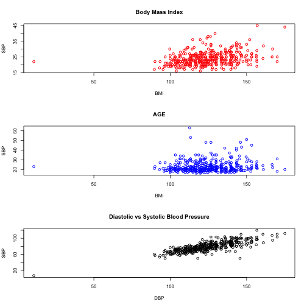

BPpresent
========================================================
author: Maria Demesa 
date: 2/20/2015

Systolic Blood Pressure Predictor
========================================================

Systolic Blood Pressure App

People that are affected by problems with their blood pressure
have heard the following:

- Reduce your salt intake
- Reduce your stress
- Keep a healthy weight
- Exercise
- No tobacco and limited alcohol (1)

But at the end we want to know how much off all this effort really 
counts.So this is the first try at developing such application.

(1)American Heart Association; http://www.heart.org/
========================================================
Since some data was needed and 2 weeks is not enough time to collect 
information. The second best thing was to found data. The dataset available
was taken from an article sited in Hindawi Corporation: 
"Predicting Increased Blood Pressure Using Machine Learning" Fernandes et all
http://www.hindawi.com/journals/jobe/2014/637635/
The actual datasets were available from figshare 
http://dx.doi.org/10.6084/m9.figshare.845665 and 
http://dx.doi.org/10.6084/m9.figshare.845664

========================================================

The information was divided in female and male. For developing the model I merge both datasets.
To obtain the model I use random trees. To obtain the prediction I use the Age, body mass index and 
Diastolic blood pressure.
 

=======================================================

The future scope will be to personalize the data because each person react different to the recomendations 
to keep Blood Pressure under control. 
Also a better model is needed in which the Diastolic Blood Pressure is not a predictor.
The purpose of the App will be to forecast how changes in habits affect the blood pressure either 
Systolic or Diastolic.

